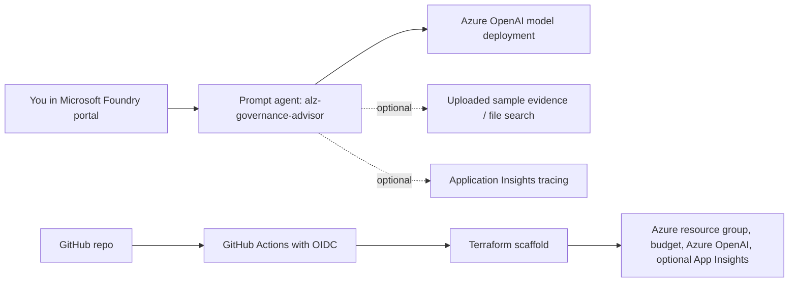

# Azure Landing Zone Governance Advisor

A portfolio-ready Microsoft Foundry / Azure OpenAI prompt agent that reviews Azure landing zone evidence against Cloud Adoption Framework guidance and produces a practical governance gap report.

This project is designed to demonstrate Azure architecture, Cloud Adoption Framework knowledge, governance, Azure Policy, Terraform, GitHub OIDC, DevOps, and cost-aware AI implementation.

## Project Structure

```text
azure-lz-governance-advisor/
  agent/             # Prompt instructions and evaluation rubric
  docs/              # Demo prompts and curated sample evidence
  infra/terraform/   # Optional Terraform scaffold for budget, Azure OpenAI, and tracing resources
  .github/workflows/ # CI/CD validation and apply flow using GitHub OIDC
```

The split is intentional:

- `agent/` contains the reusable prompt assets.
- `docs/` contains evidence and demo material for portfolio walkthroughs.
- `infra/terraform/` contains only the stable Azure scaffolding, while Foundry project and prompt-agent setup remain portal-first in v1.

`infra/terraform/.terraform/` is a local working directory generated by `terraform init` and should not be committed.

## What This Agent Does

The agent reviews evidence such as management group design, subscription layout, RBAC notes, policy assignments, networking decisions, monitoring baseline, and Terraform snippets. It then produces:

- An executive summary.
- A governance score out of 100.
- A findings table with severity, CAF/ALZ design area, evidence, gap, recommendation, and Terraform or Azure Policy hint.
- A missing evidence section.
- A 30/60/90-day remediation roadmap.
- Assumptions and limits.

The first version uses curated sample evidence instead of live Azure scanning. That keeps the project cheap, simple, and safe for a tightly budgeted Azure subscription.

## Architecture



## Cost Control First

This project is intentionally designed to avoid expensive always-on services in v1.

Use:

- Azure OpenAI token-based model usage.
- A small model such as `gpt-4.1-mini`.
- A budget alert before deploying anything.
- Optional Application Insights only when you want tracing.

Avoid in v1:

- Azure AI Search Basic or higher, unless you later decide File Search is worth the extra cost.
- App Service.
- Container Apps.
- Hosted agents.
- Live Azure Resource Graph scanner.
- Long-running compute.

Important cost notes:

- Azure OpenAI charges by model tokens.
- Microsoft notes that File Search can add charges beyond model tokens.
- Application Insights is billed through Log Analytics ingestion. Microsoft documentation notes a default pay-as-you-go Log Analytics free allowance of 5 GB per month per billing account, but you should still keep tracing light and delete resources when finished.
- Always check your subscription's Cost Management page. Pricing, regions, quotas, and free allowances can change.

## Current Microsoft References

- [Microsoft Foundry Agent Service](https://learn.microsoft.com/en-us/azure/ai-foundry/agents/overview)
- [Microsoft Foundry prompt agents](https://learn.microsoft.com/en-us/azure/foundry/agents/overview)
- [Foundry agent quickstart](https://learn.microsoft.com/azure/ai-foundry/agents/quickstart?pivots=ai-foundry-portal)
- [File Search tool for Foundry agents](https://learn.microsoft.com/en-us/azure/foundry/agents/how-to/tools/file-search)
- [Azure landing zones](https://learn.microsoft.com/en-us/azure/cloud-adoption-framework/ready/landing-zone/)
- [Azure landing zone design principles](https://learn.microsoft.com/en-us/azure/cloud-adoption-framework/ready/landing-zone/design-principles)
- [Azure landing zone governance design area](https://learn.microsoft.com/en-us/azure/cloud-adoption-framework/ready/landing-zone/design-area/governance)
- [Application Insights FAQ](https://learn.microsoft.com/en-us/azure/azure-monitor/app/application-insights-faq)
- [Set up tracing in Microsoft Foundry](https://learn.microsoft.com/en-us/azure/foundry/observability/how-to/trace-agent-setup)

## Portal-First Setup Guide

This walkthrough assumes you are new to Microsoft Foundry. Follow the steps in order.

### 1. Sign In And Confirm Your Subscription

1. Open [Azure Portal](https://portal.azure.com/).
2. Sign in with the account that owns your Azure subscription.
3. In the top search bar, search for `Subscriptions`.
4. Open `Subscriptions`.
5. Select your subscription.
6. Confirm the subscription status is `Active`.
7. Copy the subscription name somewhere handy. You will need to select it during resource creation.

If you upgraded from Free Trial to Pay-As-You-Go, keep checking `Cost Management + Billing` so you stay within your remaining free credit and budget alerts.

### 1A. Check Required Resource Providers

Azure subscriptions sometimes show a warning like `The selected provider is not registered`. If a required provider is not registered, Azure can block resource creation, quota views, or deployment flows.

For this project, check these providers before continuing:

| Provider | Needed for |
| --- | --- |
| `Microsoft.CognitiveServices` | Azure OpenAI / AI Foundry resources and model deployments. Required. |
| `Microsoft.MachineLearningServices` | Foundry project and agent experiences in some portal paths. Recommended. |
| `Microsoft.Storage` | Agent/project file storage paths and future standard setup. Recommended. |
| `Microsoft.KeyVault` | Secure project/resource integrations and future standard setup. Recommended. |
| `Microsoft.Search` | Azure AI Search or advanced retrieval. Optional for v1 unless you add AI Search. |
| `Microsoft.Insights` | Application Insights tracing. Optional. |
| `Microsoft.OperationalInsights` | Log Analytics workspace for Application Insights. Optional. |
| `Microsoft.Authorization` | Role assignments for GitHub OIDC and managed identities. Usually already registered. |
| `Microsoft.Consumption` | Budget alerts. Usually already available, but needed by the Terraform budget resource. |

You do not need `Microsoft.Compute` for this v1 portal agent unless you deploy managed compute, virtual machines, AKS, or other compute resources. The quota screen may default to `Provider: Compute`; that is not the Azure OpenAI quota provider.

To check in the Azure portal:

1. Open [Azure Portal](https://portal.azure.com/).
2. Search for `Subscriptions`.
3. Open your subscription.
4. In the left menu, select `Resource providers`.
5. Search for `Microsoft.CognitiveServices`.
6. If the status is not `Registered`, select it, then select `Register`.
7. Repeat for the recommended providers listed above.
8. Wait until the status changes to `Registered`. This can take a few minutes.

To check with Azure CLI:

```powershell
az provider show --namespace Microsoft.CognitiveServices --query "{namespace:namespace, state:registrationState}" -o table
az provider show --namespace Microsoft.MachineLearningServices --query "{namespace:namespace, state:registrationState}" -o table
```

To register with Azure CLI:

```powershell
az provider register --namespace Microsoft.CognitiveServices
az provider register --namespace Microsoft.MachineLearningServices
az provider register --namespace Microsoft.Storage
az provider register --namespace Microsoft.KeyVault
```

Only register optional providers when you are ready to use them. Microsoft recommends registering only the providers you need.

### 2. Create The Resource Group

1. In Azure Portal, search for `Resource groups`.
2. Select `Create`.
3. On the `Basics` tab:
   - Subscription: select your Azure subscription.
   - Resource group: `rg-lzadvisor-dev-aue`.
   - Region: `Australia East` if available for your services. If the model you need is unavailable later, use `East US` or another region shown in Foundry for that model.
4. Select `Review + create`.
5. Select `Create`.

Recommended tags:

| Tag | Value |
| --- | --- |
| `workload` | `landing-zone-governance-advisor` |
| `environment` | `dev` |
| `owner` | your email address |
| `cost-control` | `delete-after-demo` |

If the tag screen is not shown during creation, add tags after the resource group is created:

1. Open `rg-lzadvisor-dev-aue`.
2. Select `Tags`.
3. Add the tags above.
4. Select `Apply`.

### 3. Create A Budget Alert Before AI Resources

Do this before creating the Foundry or Azure OpenAI resources.

1. In Azure Portal, search for `Cost Management + Billing`.
2. Select `Cost Management`.
3. Select `Budgets`.
4. Select `Add`.
5. Scope:
   - If asked for scope, select your subscription.
   - If you can scope to the resource group, select `rg-lzadvisor-dev-aue`.
6. Budget details:
   - Name: `budget-lzadvisor-dev`.
   - Reset period: `Monthly`.
   - Creation date: leave default.
   - Expiration date: choose a date 1 to 3 months in the future.
   - Budget amount: `25` AUD or your preferred low threshold.
7. Alert conditions:
   - Add alert at `50%`.
   - Add alert at `80%`.
   - Add alert at `100%`.
8. Alert recipients:
   - Enter your email address.
9. Select `Create`.

Why this matters: the project is cheap by design, but budgets protect you from accidental model usage, File Search charges, or any later resources.

### 4. Open Microsoft Foundry

1. Open [Microsoft Foundry](https://ai.azure.com/).
2. Sign in with the same Azure account.
3. If you see a toggle or banner for the new Foundry experience, select the new Foundry experience.
4. If you are asked to choose a directory or tenant, select the tenant that contains your Azure subscription.

The portal names and layout can change. If you see `Azure AI Foundry` instead of `Microsoft Foundry`, continue. The goal is to create a Foundry project and a prompt agent.

### 5. Create A Foundry Project

1. In Microsoft Foundry, select `Create project`.
2. Project name: `proj-lzadvisor-dev`.
3. If asked for project type or setup:
   - Choose `Basic` setup for the first version.
   - Avoid `Standard` setup unless the portal requires it for your selected feature.
4. Subscription: select your Azure subscription.
5. Resource group: select `rg-lzadvisor-dev-aue`.
6. Region:
   - Start with the region where your deployed model is available and working.
   - If you already have `gpt-4-1-mini-lzadvisor` deployed successfully, keep using that region for the portal walkthrough.
   - If you need to recreate the project later, choose a region where `gpt-4.1-mini` has quota.
7. Resource name:
   - If Foundry asks for an AI resource or Foundry resource name, use `ai-lzadvisor-dev-aue`.
8. Networking:
   - Choose public access for the demo if prompted.
   - Do not configure private networking for v1.
9. Review the summary.
10. Select `Create`.

If the portal asks you to assign roles:

- Assign yourself `Azure AI User` on the project if prompted.
- If resource creation fails due to permissions, confirm your Azure account has Owner or Contributor on the subscription or resource group.

### 6. Deploy The Model

1. Open your project `proj-lzadvisor-dev`.
2. In the left navigation, select `Models + endpoints`.
3. Select `Deploy model`.
4. Choose `Deploy base model` if prompted.
5. Search for `gpt-4.1-mini`.
6. Select it.
7. Deployment name: `gpt-4-1-mini-lzadvisor`.
8. Deployment type:
   - Choose `Global Standard` if available.
   - Otherwise choose `Standard`.
9. Tokens per minute / quota:
   - Keep the default if it is already low.
   - If you can set it manually, choose a small value suitable for testing, such as 10K to 30K TPM.
   - Do not leave this at `0`. Azure will reject the deployment because capacity must be at least `1`.
   - If the control is stuck at `0`, your selected deployment type, model, region, or Azure OpenAI account has no assignable quota for that model. Try the troubleshooting steps below.
10. Content filter:
   - Use the default content filter.
11. Select `Deploy`.
12. Wait for the deployment to complete.
13. Copy the deployment name. You will need it when creating the agent and later when using Terraform.

Current working project value:

- Deployment name: `gpt-4-1-mini-lzadvisor`
- Model: `gpt-4.1-mini`
- Model version: `2025-04-14`

Important:

- Do not choose `gpt-4o-mini` version `2024-07-18` for a new Standard deployment if the portal shows a deprecation or retirement error.
- Microsoft currently lists `gpt-4o-mini` version `2024-07-18` as deprecated for new customers and retired for Standard deployments as of March 31, 2026.
- Use `gpt-4.1-mini` version `2025-04-14` instead if you are creating a fresh landing zone advisor deployment.
- If you already have an older `gpt-4o-mini` deployment from before deprecation, follow Microsoft's upgrade guidance and migrate it to `gpt-4.1-mini`.

### 7. Create The Prompt Agent

1. In your Foundry project, select `Agents`.
2. If you already have an auto-created agent such as `Agent682`, open that agent and edit it instead of creating a second one.
3. If you do need a new one, select `Create agent`.
4. If asked for agent type, choose `Prompt agent`.
5. Agent name: `alz-governance-advisor`.
6. Agent description:
   - Use a short plain-English summary.
   - Suggested value: `Reviews Azure landing zone evidence against Cloud Adoption Framework guidance and produces governance gap reports and remediation plans.`
   - This field is mainly for your own reference in the portal. It is not the main system prompt.
7. Model: select your deployed model:
   - `gpt-4-1-mini-lzadvisor`.
8. Instructions:
   - Open [`agent/instructions.md`](agent/instructions.md).
   - Copy the full contents.
   - Paste it into the agent instructions or system instructions box.
   - This is the important prompt field that controls agent behaviour.
9. Tools:
   - Foundry may show different tool options depending on the portal experience, region, and project type.
   - For the first test, keep the agent simple:
     - Do not add any custom functions or external actions.
     - Do not enable Code Interpreter if it appears.
     - Do not enable Browser Automation if it appears.
     - Do not enable Bing grounding or web tools if they appear.
     - File Search should stay off for the first test unless you are specifically testing uploaded evidence retrieval.
   - In plain terms, the first version should behave like a prompt-driven analysis agent using only the deployed model.
   - If your screen does not show these tool options, that is fine. Continue without changing anything and save the agent.
10. Temperature or creativity:
   - If shown, set temperature around `0.2` to keep the report consistent.
   - If the field is missing, leave the default.
11. Save the agent.

### 8. First Test Without File Search

This first test confirms the agent instructions and model work.

1. Open the agent playground.
2. Paste this prompt:

```text
You are reviewing a draft Azure landing zone. Evidence:

- Management groups: Tenant Root > Platform > LandingZones > Sandbox.
- Policies: only allowed locations and required tags are assigned.
- RBAC: subscription owners can assign roles directly.
- Networking: hub-and-spoke planned, but no firewall or private endpoint standard is documented.
- Monitoring: no diagnostic setting baseline is defined.
- Security: Defender for Cloud is not documented.

Review the landing zone evidence and identify the top governance gaps.
```

3. Run the prompt.
4. Confirm the response includes:
   - Governance score out of 100.
   - Findings table.
   - Missing evidence.
   - 30/60/90-day roadmap.
   - Assumptions and limits.

If this works, the core agent is ready.

### 9. Optional: Enable File Search For Sample Evidence

Use this only if you want the agent to search uploaded files in the portal. Microsoft documentation notes File Search can add charges beyond model token usage.

1. In the agent configuration, find `Tools`.
2. Select `Add tool`.
3. Choose `File Search`.
4. Create a new vector store or file collection if prompted.
5. Name it `vs-lzadvisor-sample-evidence`.
6. Upload these files from this repo:
   - [`docs/sample-evidence/sample-management-groups.md`](docs/sample-evidence/sample-management-groups.md)
   - [`docs/sample-evidence/sample-policy-baseline.md`](docs/sample-evidence/sample-policy-baseline.md)
   - [`docs/sample-evidence/sample-networking.md`](docs/sample-evidence/sample-networking.md)
   - [`docs/sample-evidence/sample-monitoring-security.md`](docs/sample-evidence/sample-monitoring-security.md)
   - [`docs/sample-evidence/sample-terraform-snippets.md`](docs/sample-evidence/sample-terraform-snippets.md)
7. Wait for upload and indexing to complete.
8. Save the agent.
9. Return to the playground.
10. Ask:

```text
Review the uploaded sample landing zone evidence and identify the top governance gaps.
```

What each file represents:

| File | Purpose |
| --- | --- |
| `sample-management-groups.md` | Example management group and subscription structure. |
| `sample-policy-baseline.md` | Example Azure Policy assignments and missing governance controls. |
| `sample-networking.md` | Example hub-and-spoke design notes with unresolved network standards. |
| `sample-monitoring-security.md` | Example management, diagnostics, Defender, and incident response evidence. |
| `sample-terraform-snippets.md` | Example Terraform snippets with intentional governance gaps. |

### 10. Optional: Enable Application Insights Tracing

Tracing is useful for a portfolio demo because it shows that you understand observability for AI agents. It is optional because it can ingest billable telemetry.

What tracing adds:

- Run visibility.
- Latency.
- Model calls.
- Tool calls.
- Prompt inputs and outputs.
- Retrieval operations when tools are used.

Privacy warning: traces can include user prompts, model outputs, and tool arguments. Do not submit secrets, private customer data, credentials, or sensitive documents.

Cost warning: Application Insights is billed through Log Analytics ingestion. Keep testing light and delete resources after the demo.

To enable:

1. Open your Foundry project.
2. Select `Agents`.
3. Select `Traces`.
4. Select `Connect`.
5. Choose `Create new`.
6. Name: `appi-lzadvisor-dev-aue`.
7. Resource group: `rg-lzadvisor-dev-aue`.
8. Region: choose the same region as your Foundry project where possible.
9. Log Analytics workspace:
   - If the wizard creates one automatically, accept the default.
   - If you must name one, use `log-lzadvisor-dev-aue`.
10. Create or connect the resource.
11. After connection succeeds, run one agent prompt in the playground.
12. Return to `Traces`.
13. Refresh after a few minutes.
14. Confirm one recent trace appears.

Recommended cost hygiene if you enable tracing:

1. Open the Log Analytics workspace created for Application Insights.
2. Select `Usage and estimated costs`.
3. Review ingestion after testing.
4. Select `Data retention` if available.
5. Keep retention low for this demo.
6. Delete the resource group when finished.

## Demo Prompts

See [`docs/demo-prompts.md`](docs/demo-prompts.md) for copy/paste prompts.

## Reviewing Terraform In The Playground

The Foundry playground can review attached Terraform evidence, but there are a few practical limits:

- Some playground upload flows reject `.tf` files directly.
- The message-attachment experience is file-by-file, not folder-by-folder.
- Large repos are awkward to upload manually.

Recommended workflow for v1:

1. Convert the relevant Terraform files to `.txt` or `.md` if the playground refuses `.tf`.
2. Upload only the files needed for the review, for example:
   - firewall module
   - policy assignments
   - role assignments
   - diagnostics
   - networking
3. In the prompt, explicitly tell the agent to use the attached files and name the review scope.

Suggested prompt:

```text
Review the attached Terraform files as the primary evidence for this assessment.

Focus on Azure landing zone governance gaps relating to networking, security, monitoring, RBAC, policy assignment patterns, diagnostics, and module consistency.

Only assess what is visible in the attached files. If evidence is missing, list exactly what is missing.
```

If you want to reference more of a repo:

- create a curated evidence pack rather than uploading the whole repository
- include only high-signal files
- add a short `repo-overview.md` file explaining module purpose and folder context
- consider uploading a single combined review file that concatenates important Terraform files with headings

Example combined file structure:

```text
## file: modules/firewall/main.tf
...content...

## file: modules/firewall/variables.tf
...content...

## file: policy/main.tf
...content...
```

This is often the easiest way to work around the playground's per-file limitations.

## Simple Test Plan

Use this checklist after you create the portal agent.

- [ ] Open the agent playground.
- [ ] Upload or confirm the sample evidence files are available if using File Search.
- [ ] Paste Test Prompt 1: `Review this landing zone evidence and identify the top governance gaps.`
- [ ] Confirm the answer includes a score, findings table, and missing evidence.
- [ ] Paste Test Prompt 2: `Create a 30/60/90-day remediation roadmap.`
- [ ] Confirm the answer gives practical Azure platform actions.
- [ ] Paste Test Prompt 3: `Which Azure Policy initiatives or policy areas should I prioritize?`
- [ ] Confirm the answer focuses on tagging, allowed locations, diagnostics, Defender/security, private endpoint/network controls, RBAC separation, and policy assignment structure.
- [ ] Paste Test Prompt 4 with deliberately incomplete evidence.
- [ ] Confirm the agent says what is missing instead of inventing facts.
- [ ] Optional: if Application Insights is enabled, open `Traces` and confirm one recent run appears.
- [ ] Delete the resource group when finished testing if cost control is the priority.

## Troubleshooting

### I Cannot Find gpt-4.1-mini

Create or connect a resource in another supported region shown in the model catalog, or request quota for `gpt-4.1-mini`. Do not fall back to `gpt-4o-mini` for a fresh Standard deployment path unless Microsoft documents a currently supported version for your region and subscription.

### gpt-4o-mini Fails With Deprecated Model Error

Error example:

```text
ServiceModelDeprecated ... Name:gpt-4o-mini, Version:2024-07-18 has been deprecated
```

This is not a quota issue. It means the model/version you selected is no longer valid for the deployment type you are trying to create.

Fix:

1. Cancel the `gpt-4o-mini` deployment.
2. Return to model selection.
3. Choose `gpt-4.1-mini`.
4. Use version `2025-04-14`.
5. Keep the deployment name aligned with the model, for example `gpt-4-1-mini-lzadvisor`.
6. If `gpt-4.1-mini` still has no quota in the current region, check quota in another region such as `East US 2`, then create or connect a resource in that region.

Do not spend time troubleshooting `gpt-4o-mini` Standard deployment if the portal is already returning a deprecation error. The correct action is to move to the replacement model.

### I Do Not Have Quota

1. In Foundry, open `Models + endpoints`.
2. Check the model quota message.
3. Try a smaller model.
4. Try a different region.
5. Request quota only if needed.

### Model Deployment Fails With InvalidCapacity

Error example:

```text
InvalidCapacity: The specified capacity of account deployment should be at least 1
```

This usually means the `Tokens per Minute Rate Limit` field is set to `0`, or the portal cannot assign quota for the selected model/deployment type.

Fix:

1. Stay on the deployment screen.
2. Check `Tokens per Minute Rate Limit`.
3. If the slider or field can be changed, set it to a small test value such as `10,000`.
4. Select `Deploy` again.
5. If it is stuck at `0`, change `Deployment type` from `Global Standard` to `Standard` if available.
6. If it is still stuck at `0`, create or switch to a Foundry/OpenAI resource in another available region, such as `East US`, `East US 2`, `Sweden Central`, or another region shown in the model catalog.
7. If no region has quota, submit an Azure OpenAI quota request for a small amount of TPM for the selected model.

For the cheapest demo, do not request a large quota. You only need enough capacity to run a few short test prompts.

### Do I Need To Redeploy The Project To East US?

Not always. This error is usually about the connected AI resource's available quota, not the project itself.

Azure OpenAI quota is allocated per subscription, per region, per model, and per deployment type. Your Foundry project can only deploy against connected AI resources that have available quota for the selected model and deployment type.

Use this decision process:

1. In the deployment window, check `Connected AI resource`.
2. If the only resource shown is in `australiaeast` and the TPM field is `0`, that resource has no assignable quota for the selected model/deployment type.
3. Select `Manage quota`.
4. In the quota page, turn on `Show all quota` if available.
5. Group or filter by:
   - Model: `gpt-4.1-mini`.
   - Deployment type: `Global Standard`, then `Standard`.
   - Region: `australiaeast`, `eastus`, `eastus2`, and any other available regions.
6. If another region has available TPM, create or connect an AI resource in that region and deploy the model there.
7. If the portal lets you add another connected AI resource to the same project, you can keep the project and connect the new resource.
8. If the portal does not make that easy, create a new Foundry project in the region with available quota. For a beginner demo, this is often the simplest path.
9. If every region shows `0` available TPM, request a small quota increase.

Recommendation for this portfolio demo:

- If `East US` has non-zero quota for `gpt-4.1-mini`, redeploying the project/resource in `East US` is reasonable.
- If you want Australian data residency for stored resource data, request a small quota increase in `Australia East` instead.
- Prefer `gpt-4.1-mini` for this project because it is the current supported path you already deployed successfully.

### The Agent Cannot See Uploaded Files

1. Confirm File Search is enabled on the agent.
2. Confirm the files finished indexing.
3. Save the agent after adding the tool.
4. Start a new playground conversation.
5. Ask the agent to list which uploaded evidence files it used.

### File Search Is Unavailable

Continue with copy/paste evidence in the chat prompt. The project still works without File Search.

### I Get Permission Errors

Confirm your account has:

- Contributor or Owner on the resource group for resource creation.
- Azure AI User on the Foundry project for agent creation and testing.
- Access to Application Insights if tracing is enabled.

### I See Unexpected Costs

1. Stop testing.
2. Open `Cost Management + Billing`.
3. Review costs by resource.
4. Delete the resource group `rg-lzadvisor-dev-aue` if you no longer need the demo.
5. Avoid File Search and Application Insights until you understand the cost source.

## Cleanup

To delete everything from the portal:

1. Open Azure Portal.
2. Search for `Resource groups`.
3. Open `rg-lzadvisor-dev-aue`.
4. Select `Delete resource group`.
5. Type the resource group name to confirm.
6. Select `Delete`.

To delete with Azure CLI:

```powershell
az group delete --name rg-lzadvisor-dev-aue --yes
```

## Terraform Scaffold

The Terraform scaffold in [`infra/terraform`](infra/terraform) is for the IaC phase after the portal demo is working.

It includes:

- Resource group.
- Budget alert.
- Azure OpenAI account.
- Azure OpenAI model deployment.
- Optional Application Insights and Log Analytics.
- Outputs needed for portal handoff.

The scaffold intentionally does not deploy an always-on app or container. It also keeps Application Insights disabled by default.

Example:

```powershell
cd infra/terraform
terraform init
terraform fmt
terraform validate
terraform plan -var-file="terraform.tfvars.example"
```

Before applying, copy `terraform.tfvars.example` to `terraform.tfvars` and edit the values for your subscription, email, location, and model availability.

## GitHub Actions

This repo includes:

- [`.github/workflows/terraform-check.yml`](.github/workflows/terraform-check.yml)
- [`.github/workflows/terraform-apply.yml`](.github/workflows/terraform-apply.yml)

The workflows use GitHub OIDC to Azure. Do not create or store client secrets.

### Configure GitHub OIDC

Complete this after you push the project to GitHub.

1. In Azure Portal, search for `Microsoft Entra ID`.
2. Select `App registrations`.
3. Select `New registration`.
4. Name: `app-github-lzadvisor-dev`.
5. Supported account types: `Accounts in this organizational directory only`.
6. Redirect URI: leave blank.
7. Select `Register`.
8. Copy these values from the app registration overview:
   - Application client ID.
   - Directory tenant ID.
9. Open your resource group `rg-lzadvisor-dev-aue`.
10. Select `Access control (IAM)`.
11. Select `Add role assignment`.
12. Role: `Contributor`.
13. Members: select `app-github-lzadvisor-dev`.
14. Select `Review + assign`.
15. Return to the app registration.
16. Select `Certificates & secrets`.
17. Select `Federated credentials`.
18. Select `Add credential`.
19. Federated credential scenario: `GitHub Actions deploying Azure resources`.
20. Organisation: your GitHub username or organisation.
21. Repository: the repository name.
22. Entity type:
   - For pull request plan workflow, choose `Pull request`.
   - Add a second credential for the apply workflow using `Branch` and branch name `main`.
23. Name the credentials:
   - `github-pr-plan`
   - `github-main-apply`
24. Select `Add`.

Then create GitHub repository variables:

Required GitHub repository variables:

| Variable | Purpose |
| --- | --- |
| `AZURE_CLIENT_ID` | Client ID of the Entra app or managed identity configured for federated credentials. |
| `AZURE_TENANT_ID` | Tenant ID. |
| `AZURE_SUBSCRIPTION_ID` | Azure subscription ID. |
| `BUDGET_CONTACT_EMAIL` | Email address that receives Terraform-created Azure budget alerts. |

Recommended GitHub environment:

- Create an environment named `dev`.
- Require manual approval before `terraform-apply.yml` can run.

## Resume / Portfolio Positioning

Suggested GitHub description:

> Microsoft Foundry / Azure OpenAI agent that reviews Azure landing zone evidence against Cloud Adoption Framework guidance and produces governance remediation plans, with Terraform and GitHub OIDC deployment scaffolding.

Suggested resume bullet:

> Built an Azure Landing Zone Governance Advisor using Microsoft Foundry, Azure OpenAI, Terraform, and GitHub OIDC to assess CAF alignment, identify Azure Policy/RBAC/monitoring gaps, and generate prioritized remediation roadmaps.

## Roadmap

- Add live read-only Azure Resource Graph assessment.
- Add Azure Policy compliance state ingestion.
- Add Terraform plan review mode.
- Add GitHub issue creation for remediation backlog.
- Add evaluation tests for report quality.
- Add optional Teams or Copilot publishing path.
