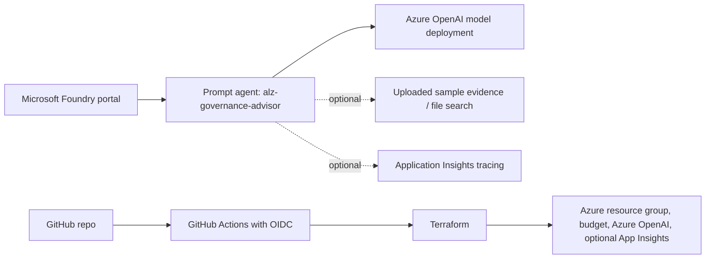

# Azure Landing Zone Governance Advisor

A Microsoft Foundry / Azure OpenAI prompt agent that reviews Azure landing zone evidence against Cloud Adoption Framework guidance and produces a practical governance gap report.

## Project Structure

```text
azure-lz-governance-advisor/
  agent/             # Prompt instructions and evaluation rubric
  docs/              # Demo prompts and curated sample evidence
  infra/terraform/   # Optional Terraform scaffold for budget, Azure OpenAI, and tracing resources
  .github/workflows/ # CI/CD validation and apply flow using GitHub OIDC
```

The split is intentional:

- `agent/` contains the reusable prompt assets.
- `docs/` contains evidence and demo material for portfolio walkthroughs.
- `infra/terraform/` contains only the stable Azure scaffolding, while Foundry project and prompt-agent setup remain portal-first in v1.

`infra/terraform/.terraform/` is a local working directory generated by `terraform init` and should not be committed.

## What This Agent Does

The agent reviews evidence such as management group design, subscription layout, RBAC notes, policy assignments, networking decisions, monitoring baseline, and Terraform snippets. It then produces:

- An executive summary.
- A governance score out of 100.
- A findings table with severity, CAF/ALZ design area, evidence, gap, recommendation, and Terraform or Azure Policy hint.
- A missing evidence section.
- A 30/60/90-day remediation roadmap.
- Assumptions and limits.

The first version uses curated sample evidence instead of live Azure scanning. That keeps the project cheap, simple, and safe for a tightly budgeted Azure subscription.

## Architecture


```mermaid
flowchart LR
    User["Microsoft Foundry portal"] --> Agent["Prompt agent: alz-governance-advisor"]
    Agent --> Model["Azure OpenAI model deployment"]
    Agent -. optional .-> Files["Uploaded sample evidence / file search"]
    Agent -. optional .-> Traces["Application Insights tracing"]
    GitHub["GitHub repo"] --> Actions["GitHub Actions with OIDC"]
    Actions --> Terraform["Terraform"]
    Terraform --> Azure["Azure resource group, budget, Azure OpenAI, optional App Insights"]
```

## Cost Control First

Intentionally designed to avoid expensive always-on services in v1.

Use:

- Azure OpenAI token-based model usage.
- A small model such as `gpt-4.1-mini`.
- A budget alert before deploying anything.
- Optional Application Insights only when you want tracing.

## Current Microsoft References

- [Microsoft Foundry Agent Service](https://learn.microsoft.com/en-us/azure/ai-foundry/agents/overview)
- [Microsoft Foundry prompt agents](https://learn.microsoft.com/en-us/azure/foundry/agents/overview)
- [Foundry agent quickstart](https://learn.microsoft.com/azure/ai-foundry/agents/quickstart?pivots=ai-foundry-portal)
- [File Search tool for Foundry agents](https://learn.microsoft.com/en-us/azure/foundry/agents/how-to/tools/file-search)
- [Azure landing zones](https://learn.microsoft.com/en-us/azure/cloud-adoption-framework/ready/landing-zone/)
- [Azure landing zone design principles](https://learn.microsoft.com/en-us/azure/cloud-adoption-framework/ready/landing-zone/design-principles)
- [Azure landing zone governance design area](https://learn.microsoft.com/en-us/azure/cloud-adoption-framework/ready/landing-zone/design-area/governance)
- [Application Insights FAQ](https://learn.microsoft.com/en-us/azure/azure-monitor/app/application-insights-faq)
- [Set up tracing in Microsoft Foundry](https://learn.microsoft.com/en-us/azure/foundry/observability/how-to/trace-agent-setup)


## First Test Without File Search

This first test confirms the agent instructions and model work.

1. Open the agent playground.
2. Paste this prompt:

```text
You are reviewing a draft Azure landing zone. Evidence:

- Management groups: Tenant Root > Platform > LandingZones > Sandbox.
- Policies: only allowed locations and required tags are assigned.
- RBAC: subscription owners can assign roles directly.
- Networking: hub-and-spoke planned, but no firewall or private endpoint standard is documented.
- Monitoring: no diagnostic setting baseline is defined.
- Security: Defender for Cloud is not documented.

Review the landing zone evidence and identify the top governance gaps.
```

3. Run the prompt.
4. Confirm the response includes:
   - Governance score out of 100.
   - Findings table.
   - Missing evidence.
   - 30/60/90-day roadmap.
   - Assumptions and limits.

If this works, the core agent is ready.

## Optional: Enable Application Insights Tracing

Tracing is useful because it shows that you understand observability for AI agents. It is optional because it can ingest billable telemetry.

What tracing adds:

- Run visibility.
- Latency.
- Model calls.
- Tool calls.
- Prompt inputs and outputs.
- Retrieval operations when tools are used.

Privacy warning: traces can include user prompts, model outputs, and tool arguments. Do not submit secrets, private customer data, credentials, or sensitive documents.

Cost warning: Application Insights is billed through Log Analytics ingestion. Keep testing light and delete resources after the demo.

To enable:

1. Open your Foundry project.
2. Select `Agents`.
3. Select `Traces`.
4. Select `Connect`.
5. Choose `Create new`.
6. Name: `appi-lzadvisor-dev-aue`.
7. Resource group: `rg-lzadvisor-dev-aue`.
8. Region: choose the same region as your Foundry project where possible.
9. Log Analytics workspace:
   - If the wizard creates one automatically, accept the default.
   - If you must name one, use `log-lzadvisor-dev-aue`.
10. Create or connect the resource.
11. After connection succeeds, run one agent prompt in the playground.
12. Return to `Traces`.
13. Refresh after a few minutes.
14. Confirm one recent trace appears.

Recommended cost hygiene if you enable tracing:

1. Open the Log Analytics workspace created for Application Insights.
2. Select `Usage and estimated costs`.
3. Review ingestion after testing.
4. Select `Data retention` if available.
5. Keep retention low for this demo.
6. Delete the resource group when finished.

## Demo Prompts

See [`docs/demo-prompts.md`](docs/demo-prompts.md) for copy/paste prompts.

## Reviewing Terraform In The Playground

The Foundry playground can review attached Terraform evidence, but there are a few practical limits:

- Some playground upload flows reject `.tf` files directly.
- The message-attachment experience is file-by-file, not folder-by-folder.
- Large repos are awkward to upload manually.

Recommended workflow for v1:

1. Convert the relevant Terraform files to `.txt` or `.md` if the playground refuses `.tf`.
2. Upload only the files needed for the review, for example:
   - firewall module
   - policy assignments
   - role assignments
   - diagnostics
   - networking
3. In the prompt, explicitly tell the agent to use the attached files and name the review scope.

Suggested prompt:

```text
Review the attached Terraform files as the primary evidence for this assessment.

Focus on Azure landing zone governance gaps relating to networking, security, monitoring, RBAC, policy assignment patterns, diagnostics, and module consistency.

Only assess what is visible in the attached files. If evidence is missing, list exactly what is missing.
```

If you want to reference more of a repo:

- create a curated evidence pack rather than uploading the whole repository
- include only high-signal files
- add a short `repo-overview.md` file explaining module purpose and folder context
- consider uploading a single combined review file that concatenates important Terraform files with headings

Example combined file structure:

```text
## file: modules/firewall/main.tf
...content...

## file: modules/firewall/variables.tf
...content...

## file: policy/main.tf
...content...
```

This is often the easiest way to work around the playground's per-file limitations.

## Simple Test Plan

Use this checklist after you create the portal agent.

- [ ] Open the agent playground.
- [ ] Upload or confirm the sample evidence files are available if using File Search.
- [ ] Paste Test Prompt 1: `Review this landing zone evidence and identify the top governance gaps.`
- [ ] Confirm the answer includes a score, findings table, and missing evidence.
- [ ] Paste Test Prompt 2: `Create a 30/60/90-day remediation roadmap.`
- [ ] Confirm the answer gives practical Azure platform actions.
- [ ] Paste Test Prompt 3: `Which Azure Policy initiatives or policy areas should I prioritize?`
- [ ] Confirm the answer focuses on tagging, allowed locations, diagnostics, Defender/security, private endpoint/network controls, RBAC separation, and policy assignment structure.
- [ ] Paste Test Prompt 4 with deliberately incomplete evidence.
- [ ] Confirm the agent says what is missing instead of inventing facts.
- [ ] Optional: if Application Insights is enabled, open `Traces` and confirm one recent run appears.
- [ ] Delete the resource group when finished testing if cost control is the priority.

## GitHub Actions

This repo includes:

- [`.github/workflows/terraform-check.yml`](.github/workflows/terraform-check.yml)
- [`.github/workflows/terraform-apply.yml`](.github/workflows/terraform-apply.yml)

The workflows use GitHub OIDC to Azure. Do not create or store client secrets.

### Configure GitHub OIDC

Complete this after you push the project to GitHub.

1. In Azure Portal, search for `Microsoft Entra ID`.
2. Select `App registrations`.
3. Select `New registration`.
4. Name: `app-github-lzadvisor-dev`.
5. Supported account types: `Accounts in this organizational directory only`.
6. Redirect URI: leave blank.
7. Select `Register`.
8. Copy these values from the app registration overview:
   - Application client ID.
   - Directory tenant ID.
9. Open your resource group `rg-lzadvisor-dev-aue`.
10. Select `Access control (IAM)`.
11. Select `Add role assignment`.
12. Role: `Contributor`.
13. Members: select `app-github-lzadvisor-dev`.
14. Select `Review + assign`.
15. Return to the app registration.
16. Select `Certificates & secrets`.
17. Select `Federated credentials`.
18. Select `Add credential`.
19. Federated credential scenario: `GitHub Actions deploying Azure resources`.
20. Organisation: your GitHub username or organisation.
21. Repository: the repository name.
22. Entity type:
   - For pull request plan workflow, choose `Pull request`.
   - Add a second credential for the apply workflow using `Branch` and branch name `main`.
23. Name the credentials:
   - `github-pr-plan`
   - `github-main-apply`
24. Select `Add`.

Then create GitHub repository variables:

Required GitHub repository variables:

| Variable | Purpose |
| --- | --- |
| `AZURE_CLIENT_ID` | Client ID of the Entra app or managed identity configured for federated credentials. |
| `AZURE_TENANT_ID` | Tenant ID. |
| `AZURE_SUBSCRIPTION_ID` | Azure subscription ID. |
| `BUDGET_CONTACT_EMAIL` | Email address that receives Terraform-created Azure budget alerts. |

Recommended GitHub environment:

- Create an environment named `dev`.
- Require manual approval before `terraform-apply.yml` can run.