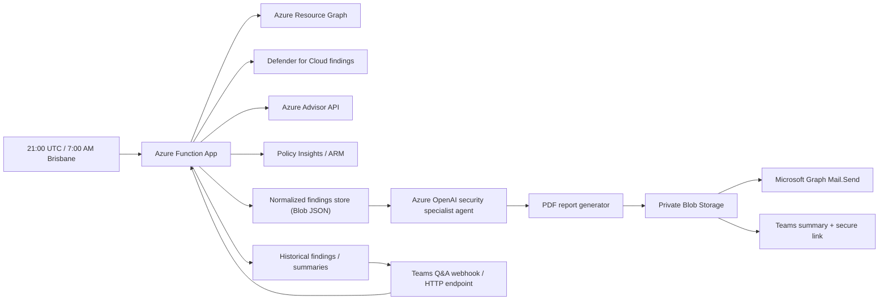

# Azure Tenant Security Specialist Agent

An Azure-native AI security specialist agent that performs daily tenant-wide security posture assessment, generates a PDF report, delivers it to email and Teams, and supports engineer follow-up Q&A about findings.

Future version 2.0 will allow the engineer to choose to take a remediation action against the vulnerability, and have a change request automatically submitted for approval and review.

## What This Solution Does

Every day at **7:00 AM Australia/Brisbane**, the scheduled reporting path:

- scans the Azure tenant for:
  - Microsoft Defender for Cloud findings
  - Azure Advisor security recommendations
  - Azure Policy / Policy Insights non-compliance
  - custom Azure Resource Graph posture checks
- normalises findings into structured JSON
- computes a deterministic `total_impact_score`
- asks an Azure OpenAI agent to summarise, prioritise, and explain the results
- generates a PDF report
- stores the PDF privately in Azure Blob Storage
- emails the PDF to a mailbox
- posts a Teams channel summary with a secure report link

Separately, the analyst Q&A path lets engineers ask follow-up questions about latest and historical findings through a Teams-facing HTTP endpoint.

## Architecture



## Project Structure

- `agent/`
  - AI instructions and evaluation rubric
- `docs/`
  - architecture, deployment notes, Teams integration notes, sample prompts
- `infra/terraform/`
  - secure-by-default Azure deployment scaffold
- `src/`
  - Azure Functions code, collectors, scoring, storage, report generation, and delivery
- `.github/workflows/`
  - Terraform and Function deployment workflows

## Security Model

The platform is designed to be secure by default.

Security controls applied in Terraform:

- Key Vault with purge protection and RBAC authorization
- Storage Account with:
  - public access disabled
  - TLS 1.2 minimum
  - shared access limited to signed, short-lived report links
  - blob versioning
- Function App with:
  - HTTPS only
  - FTPS disabled
  - minimum TLS 1.2
  - managed identity
  - Application Insights
- User-assigned managed identity for Azure access
- Azure OpenAI access via Entra ID role assignment instead of API keys
- Budget alert

Important nuance:

- The Q&A endpoint is an externally callable HTTP endpoint because it is intended to receive Teams-originated requests.
- This is the only public-facing application surface in v1 and should be protected with a function key plus a shared secret or header validation before production use.

## Azure Resources

Terraform deploys:

- Resource group
- Log Analytics workspace
- Application Insights
- Storage Account
- Private Blob containers for reports and findings
- Key Vault
- User-assigned managed identity
- Windows Function App plan
- Windows Function App
- Azure OpenAI account and `gpt-4.1-mini` deployment
- Role assignments
- Budget alert

## AI Agent Responsibilities

The AI layer is deliberately separate from the deterministic scanning logic.

Deterministic code:

- collects findings
- scores severity/impact
- stores evidence
- generates PDF layout
- sends notifications

AI agent:

- groups related issues
- explains why findings matter
- identifies top risks
- proposes remediation priorities
- answers engineer questions in natural language

This makes the solution an **AI-powered security posture agent**, not just a scanner or static reporting tool.

## Scheduled Reporting Flow

1. Timer trigger fires daily at **21:00 UTC**, which equals **7:00 AM Australia/Brisbane** year-round.
2. Azure Functions collect findings across the tenant.
3. Raw findings are normalized and stored in Blob Storage.
4. The Azure OpenAI security specialist agent summarises the findings.
5. A PDF report is generated and uploaded privately.
6. An email is sent with the PDF attached.
7. A Teams channel summary is posted with a secure time-limited report link.

## Engineer Q&A Flow

1. Engineer asks a question from the Teams-facing integration surface.
2. The Q&A endpoint receives the request.
3. The endpoint loads the latest or requested historical run data.
4. The Azure OpenAI security specialist agent answers using:
   - structured findings
   - summaries
   - remediation context
5. The response is returned to Teams.

Example questions:

- `What are today's critical findings?`
- `Which subscriptions had public access findings?`
- `Why is this Key Vault high severity?`
- `What Terraform or policy change would fix this?`
- `Which findings are new since yesterday?`

## Top Resource-Type Checks In v1

Custom posture checks cover:

- Storage Accounts
- Key Vault
- Azure SQL
- App Service / Function Apps
- Cosmos DB
- AKS
- VMs
- Public IP / NSG / Firewall posture

Examples:

- public network access enabled
- anonymous/public blob access
- Key Vault purge protection missing
- App Service HTTPS-only disabled
- SQL public network access enabled
- Cosmos DB public access enabled
- AKS local accounts enabled
- internet-reachable public IP exposure

## Impact Scoring

The code computes `total_impact_score` before AI summarisation:

- High = 10
- Medium = 5
- Low = 2
- add a multiplier when public exposure is present

The AI layer explains the score, but does not invent it.

## Teams Integration Model

This repo implements:

- scheduled Teams summary delivery via outbound HTTP to a Teams-compatible integration endpoint
- a Teams-facing Q&A HTTP endpoint in the Function App

Recommended production pattern:

- Teams channel summary delivered through a Teams Workflow or approved webhook pattern
- engineer Q&A wired through a Teams app, outgoing webhook, or secure intermediary workflow that calls the Function endpoint

The Azure code path is implemented here; the exact Teams registration object depends on your tenant's approved Teams integration model.

## App Settings And Secrets

Key settings expected by the Function App:

| Setting | Purpose |
| --- | --- |
| `AZURE_OPENAI_ENDPOINT` | Azure OpenAI endpoint |
| `AZURE_OPENAI_DEPLOYMENT` | Model deployment name |
| `TEAMS_SUMMARY_WEBHOOK_URL` | Teams channel summary delivery endpoint |
| `TEAMS_QNA_SHARED_SECRET` | Shared secret for Q&A requests |
| `REPORT_MAILBOX_FROM` | Mailbox used for report sending |
| `REPORT_MAILBOX_TO` | Recipient mailbox list |
| `REPORT_BLOB_CONTAINER` | Report container name |
| `FINDINGS_BLOB_CONTAINER` | Findings container name |

Store mutable secrets in Key Vault and reference them from the Function App.

## Deployment

### Terraform

```powershell
cd infra/terraform
terraform init
terraform fmt
terraform validate
Copy-Item terraform.tfvars.example terraform.tfvars
terraform plan -var-file="terraform.tfvars"
```

### GitHub Actions

Workflows included:

- `terraform-check.yml`
- `terraform-apply.yml`
- `function-deploy.yml`

Use GitHub OIDC only. No client secrets are required.

## Repository Hygiene Notes

- `infra/terraform/.terraform/` and Python `__pycache__/` folders are local build/runtime artefacts and should not be committed.
- Use `terraform.tfvars.example` as the template for local configuration, then create an untracked `terraform.tfvars` file for real values.

## Testing

Minimum validation:

- run the HTTP Q&A endpoint locally or in Azure with a sample payload
- run the scheduled function manually
- confirm findings JSON was stored
- confirm a PDF was generated
- confirm email delivery
- confirm Teams summary delivery
- ask a follow-up question about a stored report
